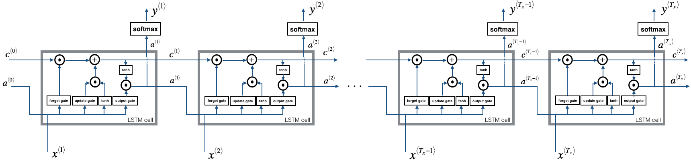
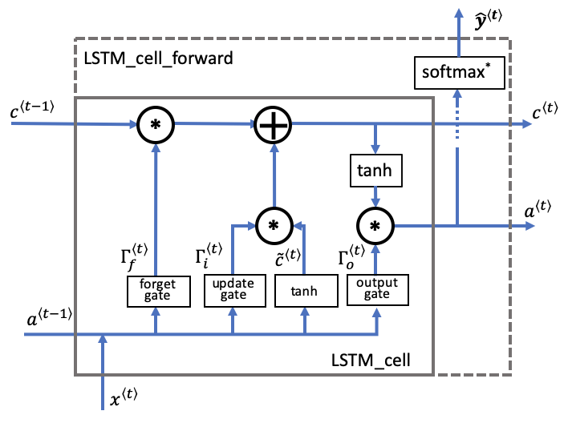
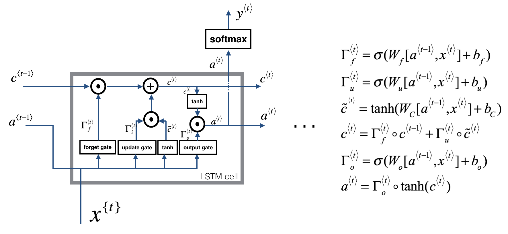
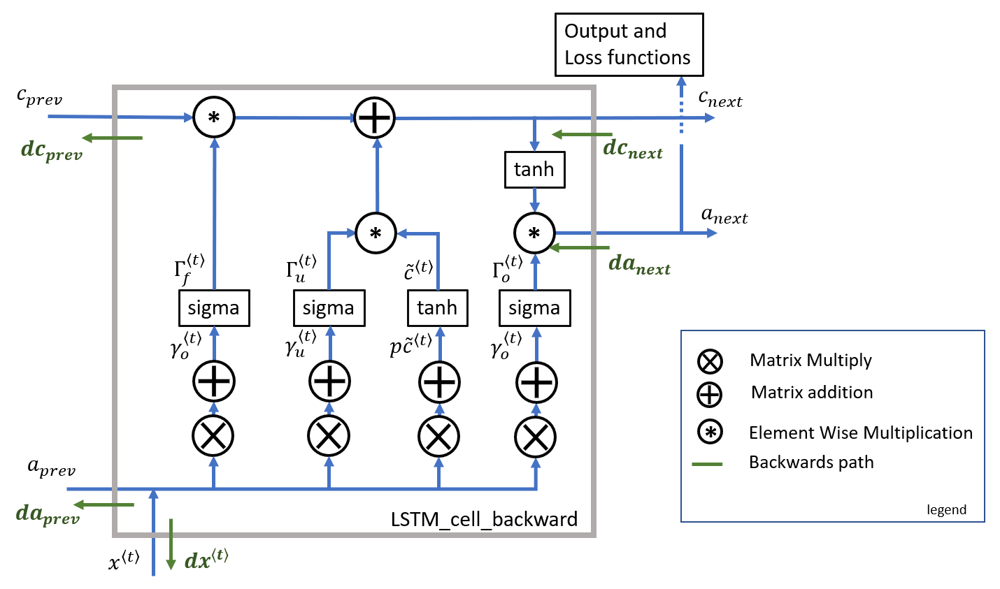

# LSTM from Scratch — Derivation & Implementation

A **Long Short-Term Memory (LSTM) network built from scratch in NumPy** — no
deep-learning framework for the model itself. This repository has two parts:

1. **The theory** — a complete, hand-derived account of how an LSTM works: the four
   gates, the cell-state recurrence, the softmax + cross-entropy gradient, and full
   **Backpropagation Through Time (BPTT)** through the gates, with every step shown
   explicitly and illustrated.
2. **A full-stack sentiment app** — the same LSTM applied to a real task: classifying
   product-review sentiment (negative / neutral / positive). It is implemented **three
   ways on identical data** — from scratch in NumPy (the derivation in Part 1, turned
   into code), and in **PyTorch** and **TensorFlow** — across four text encoders
   (word2vec, fastText, GloVe, BERT), then served through a **FastAPI** backend and a
   **React** UI that shows every model's prediction + confidence side by side.

> Educational project: the goal is to make the mechanics of an LSTM explicit and
> readable, not to be fast or state-of-the-art.

---

# Part 1 — How an LSTM Works (Derivation)

A complete mathematical derivation of forward propagation and backpropagation through
time (BPTT) for an LSTM, including the four gate equations, the softmax gradient, the
cross-entropy loss gradient, and the vector/matrix gradient rules.

> **Convention.** The diagrams below use the textbook **column-vector** form, e.g.
> `Γf = σ(Wf·[a_prev, x] + bf)`. The **code derives and implements the equivalent
> batch-first / row-vector layout** that the implementation actually uses: data is
> shaped `(m, T_x, n_x)` (examples are rows), the gate-input concatenation is
> `z = [a_prev, x]` of shape `(m, n_a + n_x)`, and a gate is `σ(z · Wᵀ + b)` — weights
> stored as `(n_a, n_a + n_x)` and applied **transposed, to the right of the data**.
> The two forms are exact transposes of each other: the gradients are identical and only
> the orientation differs. **Every backward equation in §7 is written in the batch-first
> form, matching the NumPy code line for line.**

## Table of Contents

- [Part 1 — How an LSTM Works (Derivation)](#part-1--how-an-lstm-works-derivation)
  - [1. LSTM Architecture Overview](#1-lstm-architecture-overview)
  - [2. Forward Propagation](#2-forward-propagation)
  - [3. Softmax — Definition \& Gradient](#3-softmax--definition--gradient)
  - [4. Loss Function — Cross-Entropy](#4-loss-function--cross-entropy)
  - [5. Gradient of Loss w.r.t. Logits](#5-gradient-of-loss-wrt-logits)
  - [6. Gradient of Vectors and Matrices](#6-gradient-of-vectors-and-matrices)
  - [7. Backpropagation Through Time (BPTT) — batch-first](#7-backpropagation-through-time-bptt--batch-first)
  - [8. Summary of Gradient Equations](#8-summary-of-gradient-equations)
- [Part 2 — Sentiment Classification App (Full-Stack)](#part-2--sentiment-classification-app-full-stack)

---

## 1. LSTM Architecture Overview

A vanilla RNN carries a single hidden state `a⟨t⟩` across time and updates it by
overwriting it at every step. Because that update repeatedly multiplies by the same
recurrent weight, gradients either **vanish** or **explode** over long sequences, so the
network struggles to learn long-range dependencies.

An **LSTM** fixes this by adding a second state — the **cell state** `c⟨t⟩` — that flows
along the top of the cell with only *additive* and *gated* interactions. Three sigmoid
**gates** (forget, update, output) and one `tanh` **candidate** decide what to erase from
`c`, what to write into it, and what to expose as the hidden state. The additive cell-state
path is the "gradient highway" that lets information (and gradients) travel many steps
without being squashed.



**Two states carried across time:**
- `a⟨t⟩` — hidden state (the cell's output, also fed to the next step and the output layer)
- `c⟨t⟩` — cell state (long-term memory, the additive highway)

**Parameters (shared across all time steps), per stacked layer:**
- `Wf, bf` — forget gate
- `Wi, bi` — update (input) gate
- `Wc, bc` — candidate cell
- `Wo, bo` — output gate
- `Wy, by` — output (dense) layer: top hidden state → logits

Each gate weight acts on the concatenation `[a⟨t-1⟩, x⟨t⟩]`, so a single matrix mixes the
previous hidden state and the current input.

---

## 2. Forward Propagation

At each step `t` the cell concatenates the previous hidden state with the current input,
computes the four gates, updates the cell state, and reads out the new hidden state.



**Forget gate** — how much of the old cell state to keep:
```
Γf⟨t⟩ = σ(Wf · [a⟨t-1⟩, x⟨t⟩] + bf)
```

**Update (input) gate** — how much of the new candidate to write:
```
Γu⟨t⟩ = σ(Wu · [a⟨t-1⟩, x⟨t⟩] + bu)
```

**Candidate cell** — the proposed new content:
```
c̃⟨t⟩ = tanh(Wc · [a⟨t-1⟩, x⟨t⟩] + bc)
```

**Cell-state update** — forget the old, add the new (both element-wise `∘`):
```
c⟨t⟩ = Γf⟨t⟩ ∘ c⟨t-1⟩ + Γu⟨t⟩ ∘ c̃⟨t⟩
```

**Output gate** — how much of the cell state to expose:
```
Γo⟨t⟩ = σ(Wo · [a⟨t-1⟩, x⟨t⟩] + bo)
```

**Hidden state** — the gated, squashed cell state:
```
a⟨t⟩ = Γo⟨t⟩ ∘ tanh(c⟨t⟩)
```

**Output logits and probabilities** (at every step — many-to-many next-token modelling):
```
y⟨t⟩ = Wy · a⟨t⟩ + by
ŷ⟨t⟩ = softmax(y⟨t⟩)
```

The same six equations summarized alongside the cell diagram:



> **Batch-first form (what the code computes).** With `z = [a⟨t-1⟩, x⟨t⟩]` shaped
> `(m, n_a + n_x)` and weights stored as `(n_a, n_a + n_x)`, each gate is
> `σ(z · Wᵀ + b)` and `c̃ = tanh(z · Wcᵀ + bc)`. The cell update and hidden state are
> unchanged (they are element-wise). See [`lstm_scratch.py`](lstm_scratch.py),
> `layer_forward`.

---

## 3. Softmax — Definition & Gradient

The output layer is identical to a plain classifier, so the softmax + cross-entropy
gradient is derived once here and reused for the LSTM's per-step output.

The softmax of logit vector `y` at index `i` is:

$$s_i = \frac{e^{y_i}}{\sum_{k=1}^{n} e^{y_k}}$$

We can write this as `s_i = h(y) / g(y)` where:

$$h(y) = e^{y_i}, \qquad g(y) = \sum_{k=1}^{n} e^{y_k}$$

The derivative with respect to `y_j` (quotient rule):

$$\frac{\partial s_i}{\partial y_j} = \frac{h'(y)\, g(y) - g'(y)\, h(y)}{(g(y))^2}$$

We need:

$$\frac{\partial h(y)}{\partial y_j} = h'(y) = e^{y_i} \quad \text{(if } i = j\text{, else 0 → constant)}$$

$$\frac{\partial g(y)}{\partial y_j} = \frac{\partial}{\partial y_j} \sum_{k=1}^{n} e^{y_k} = e^{y_j}$$

**Case i: j = i (diagonal).** When `i = j`, `h'(y) = e^{y_i}` and `g'(y) = e^{y_i}`:

$$\frac{\partial s_i}{\partial y_j} = \frac{e^{y_i} \cdot \sum e^{y_k} - e^{y_i} \cdot e^{y_i}}{(\sum e^{y_k})^2} = \frac{e^{y_i}}{\sum e^{y_k}} \left(1 - \frac{e^{y_j}}{\sum e^{y_k}}\right)$$

$$\boxed{\frac{\partial s_i}{\partial y_j} = s_i (1 - s_j)} \quad \text{when } j = i$$

**Case ii: j ≠ i (off-diagonal).** When `i ≠ j`, `h'(y) = 0`:

$$\frac{\partial s_i}{\partial y_j} = \frac{0 - e^{y_j} \cdot e^{y_i}}{(\sum e^{y_k})^2} = -s_i \cdot s_j$$

$$\boxed{\frac{\partial s_i}{\partial y_j} = -s_i s_j} \quad \text{when } j \neq i$$

**Combined Jacobian of softmax:**

$$\frac{\partial s_i}{\partial y_j} = \begin{cases} s_i(1 - s_j) & \text{if } j = i \\ -s_i s_j & \text{if } j \neq i \end{cases}$$

---

## 4. Loss Function — Cross-Entropy

For a correct class index `m`, the cross-entropy loss is:

$$\ell = -\log(s_m), \qquad s_m = \frac{e^{y_m}}{\sum_{k} e^{y_k}}$$

The gradient with respect to `s_m`:

$$\frac{\partial \ell}{\partial s_m} = -\frac{1}{s_m}$$

---

## 5. Gradient of Loss w.r.t. Logits

By the chain rule, the loss gradient flows back through the softmax to the logits:

$$\frac{\partial \ell}{\partial y_j} = \frac{\partial \ell}{\partial s_m} \cdot \frac{\partial s_m}{\partial y_j}$$

**Case i: j = m.** Using `∂s_m/∂y_j = s_m(1 - s_j)`:

$$\frac{\partial \ell}{\partial y_j} = -\frac{1}{s_m} \cdot s_m(1 - s_j) = s_j - 1$$

$$\boxed{\frac{\partial \ell}{\partial y_j} = s_m - 1} \quad \text{if } j = m$$

**Case ii: j ≠ m.** Using `∂s_m/∂y_j = -s_m · s_j`:

$$\frac{\partial \ell}{\partial y_j} = -\frac{1}{s_m} \cdot (-s_m \cdot s_j) = s_j$$

$$\boxed{\frac{\partial \ell}{\partial y_j} = s_j} \quad \text{if } j \neq m$$

**Combined:**

$$\frac{\partial \ell}{\partial y_j} = \begin{cases} s_m - 1 & \text{if } j = m \\ s_j & \text{if } j \neq m \end{cases}$$

> **Intuition:** This is simply `ŷ - one_hot(true_label)` — the predicted probability
> vector minus the ground-truth indicator. This is exactly the `y_pred - Y` you'll see in
> the code (`dscores = (y_pred - Y) / (m * T_x)`).

---

## 6. Gradient of Vectors and Matrices

For a linear transformation `y = Wx`, the gradients are:

$$\frac{\partial L}{\partial W} = \frac{\partial L}{\partial y} \cdot x^T, \qquad \frac{\partial L}{\partial x} = W^T \cdot \frac{\partial L}{\partial y}$$

**Intuition:** The weight gradient is the outer product of the upstream gradient and the
input. The input gradient backpropagates the upstream error through the transpose of the
weight matrix. These two rules differentiate every linear step in the LSTM gates.

> **Batch-first form.** With examples as rows (`y = z·Wᵀ + b`, `z` shaped `(m, ·)`), the
> same rules read `∂L/∂W = (∂L/∂y)ᵀ · z` and `∂L/∂z = (∂L/∂y) · W`, with the bias gradient
> `∂L/∂b = Σ_rows ∂L/∂y` summed over the batch. These are the exact lines used in §7.

---

## 7. Backpropagation Through Time (BPTT) — batch-first

BPTT walks the sequence in reverse, routing the gradient through each cell and
accumulating it into the shared gate weights. A single cell receives two incoming
gradients — `da_next` (into the hidden state, from the output layer and the next step)
and `dc_next` (into the cell state, from the next step) — and emits `da_prev`, `dc_prev`,
and `dx`, plus the parameter gradients.



All equations below are in the **batch-first** layout the code uses: `z = [a_prev, x_t]`
of shape `(m, n_a + n_x)`, gates of shape `(m, n_a)`, and weights `W·` of shape
`(n_a, n_a + n_x)`. They match [`lstm_scratch.py`](lstm_scratch.py) `layer_backward`
line for line.

### Output layer (per timestep)

With `scores = a_top · Wyᵀ + by` and the softmax+CE result from §5,
`dscores = (ŷ − Y) / (m·T_x)`. Applying the batch-first rules of §6 across the batch and
time axes:

$$\frac{\partial L}{\partial W_y} = \sum_{t} (\text{dscores}^{\langle t\rangle})^T \cdot a_{\text{top}}^{\langle t\rangle}, \qquad \frac{\partial L}{\partial b_y} = \sum_{m,t}\text{dscores}, \qquad \frac{\partial L}{\partial a_{\text{top}}} = \text{dscores} \cdot W_y$$

That `da_top` is the gradient fed into the top recurrent layer at every timestep.

### 1 — Into the hidden and cell states

Total gradient into `a⟨t⟩` (sum of the upstream from above and the carry from the next step):

$$da = da_{\text{above}}^{\langle t\rangle} + da_{\text{next}}$$

Through `a⟨t⟩ = Γo ∘ tanh(c⟨t⟩)`, split between the output gate and the cell state, and add
the carried `dc_next`:

$$dc = da \,\circ\, \Gamma_o \,\circ\, \big(1 - \tanh^2(c^{\langle t\rangle})\big) + dc_{\text{next}}$$

### 2 — Gate pre-activation gradients

Differentiating `a⟨t⟩` and the cell update `c⟨t⟩ = Γf ∘ c⟨t-1⟩ + Γu ∘ c̃` w.r.t. each gate,
then back through its activation (`σ'(x) = σ(1−σ)` for the gates, `1 − tanh²` for the
candidate):

$$d\tilde{o} = da \,\circ\, \tanh(c^{\langle t\rangle}) \,\circ\, \Gamma_o(1-\Gamma_o)$$

$$d\tilde{c} = dc \,\circ\, \Gamma_u \,\circ\, (1 - \tilde{c}^{\,2})$$

$$d\tilde{i} = dc \,\circ\, \tilde{c} \,\circ\, \Gamma_u(1-\Gamma_u)$$

$$d\tilde{f} = dc \,\circ\, c^{\langle t-1\rangle} \,\circ\, \Gamma_f(1-\Gamma_f)$$

(Here `d̃o, d̃c, d̃i, d̃f` are the gradients w.r.t. the **pre-activations** `z·Wᵀ + b` of the
output gate, candidate, update gate and forget gate respectively — i.e. `dot`, `dcct`,
`dit`, `dft` in the code.)

### 3 — Weight and bias gradients

Each gate pre-activation is `z · Wᵀ + b`, so by §6 (batch-first) the weight gradient is the
upstream gradient transposed times `z`, summed over the batch, and accumulated over time:

$$\frac{\partial L}{\partial W_f} \mathrel{+}= d\tilde{f}^{\,T} \cdot z, \quad \frac{\partial L}{\partial W_i} \mathrel{+}= d\tilde{i}^{\,T} \cdot z, \quad \frac{\partial L}{\partial W_c} \mathrel{+}= d\tilde{c}^{\,T} \cdot z, \quad \frac{\partial L}{\partial W_o} \mathrel{+}= d\tilde{o}^{\,T} \cdot z$$

$$\frac{\partial L}{\partial b_\bullet} \mathrel{+}= \sum_{\text{batch}} d\tilde{\bullet}$$

### 4 — Gradients carried to the previous step

The gradient w.r.t. the concatenation `z` collects all four gate paths; split it back into
the hidden-state and input halves. The cell-state carry comes straight through the forget
gate:

$$dz = d\tilde{f} \cdot W_f + d\tilde{i} \cdot W_i + d\tilde{c} \cdot W_c + d\tilde{o} \cdot W_o$$

$$da_{\text{prev}} = dz[:, :n_a], \qquad dx^{\langle t\rangle} = dz[:, n_a:], \qquad dc_{\text{prev}} = dc \,\circ\, \Gamma_f$$

Then carry `da_next ← da_prev` and `dc_next ← dc_prev` into step `t−1`. In a stacked LSTM
the `dx` of a layer becomes the `da_above` of the layer below.

> **Why LSTMs train better than RNNs.** The cell-state carry is just
> `dc_prev = dc ∘ Γf` — multiplication by the forget gate, with **no repeated `tanh`
> factor and no fixed recurrent matrix**. When `Γf ≈ 1` the gradient passes back through
> many steps almost undamped, which is exactly the vanishing-gradient cure the additive
> cell state was designed for.

---

## 8. Summary of Gradient Equations

| Quantity | Gradient (batch-first) |
|---|---|
| Loss `∂ℓ/∂y` (softmax+CE) | `ŷ − Y` |
| `∂L/∂Wy` | `Σₜ dscoresᵀ · a_top` |
| `∂L/∂a_top` | `dscores · Wy` |
| `da` (into `a⟨t⟩`) | `da_above + da_next` |
| `dc` (into `c⟨t⟩`) | `da ∘ Γo ∘ (1 − tanh²c) + dc_next` |
| `dõ` (output gate pre-act) | `da ∘ tanh(c) ∘ Γo(1 − Γo)` |
| `dc̃` (candidate pre-act) | `dc ∘ Γu ∘ (1 − c̃²)` |
| `dĩ` (update gate pre-act) | `dc ∘ c̃ ∘ Γu(1 − Γu)` |
| `df̃` (forget gate pre-act) | `dc ∘ c⟨t−1⟩ ∘ Γf(1 − Γf)` |
| `∂L/∂W•` | `d•ᵀ · z` (z = `[a_prev, x]`) |
| `∂L/∂b•` | `Σ_batch d•` |
| `dz` | `df̃·Wf + dĩ·Wi + dc̃·Wc + dõ·Wo` |
| `da_prev` | `dz[:, :n_a]` |
| `dx⟨t⟩` | `dz[:, n_a:]` |
| `dc_prev` | `dc ∘ Γf` |

---

# Part 2 — Sentiment Classification App (Full-Stack)

Part 1 derives an LSTM. Part 2 turns that derivation into a working app: the same
LSTM is implemented from scratch in NumPy (plus PyTorch and TensorFlow versions),
trained to classify review sentiment, and served behind a small web UI.

## What it does

Given a product review, it predicts the sentiment — **negative / neutral / positive** —
and shows how the models compare on the same sentence: **four text encoders**
(word2vec · fastText · GloVe · BERT) × **three implementations** of the same LSTM:

| Implementation | File | Notes |
|---|---|---|
| **PyTorch** | `model_artifacts_generation.py` | `nn.LSTM`, 2 layers + dropout, last-real-word readout |
| **TensorFlow** | `model_artifacts_generation.py` | `keras.layers.LSTM` → softmax |
| **Manual (NumPy)** | `manual_lstm.py` | from scratch: 4-gate cell, BPTT, Adam — the Part 1 derivation, applied to classification |

A **FastAPI** backend loads the trained models and a **React** frontend (or the
Streamlit app) sends a review to it and displays each model's label, confidence, and
class probabilities, plus a consensus vote.

## Project structure

```
LSTM/
├── code/
│   ├── model_building/                 # produces the models
│   │   ├── data_generation.py          # 1. download + split reviews -> data/raw/
│   │   ├── encoder.py                  # 2. build+trim encoders, encode splits
│   │   ├── model_artifacts_generation.py  # 3. train PyTorch + TF + manual LSTMs
│   │   ├── manual_lstm.py              #    the from-scratch NumPy LSTM (used by step 3)
│   │   └── run_pipeline.py             #    runs steps 1-3 end to end
│   └── backend/                        # serves the models (predictor.py + FastAPI app.py)
├── frontend/                           # Vite + React UI
├── streamlit_app.py                    # Streamlit deploy entry point
└── data/                               # raw splits, trimmed encoders, embeddings, model artifacts
```

## Build + run

```bash
# 1. build the models (data -> encoder -> train). reuse existing data + encoders:
cd code/model_building && python run_pipeline.py --skip data encoder

# 2. backend + frontend (two terminals)
cd code/backend && uvicorn app:app --reload --port 8000
cd frontend && npm install && npm run dev        # http://localhost:5173

# or the Streamlit app:
streamlit run streamlit_app.py
```

Encoders are trimmed to the dataset vocabulary in memory and only the small copies are
saved (a few MB each); BERT loads from HuggingFace at runtime. See
[`code/README.md`](code/README.md) for details. The data pipeline and encoders are
identical to the Vanilla-RNN / GRU projects — only the model architecture differs.

---

## Reference

The architecture diagrams and the overall framing of the forward/backward passes follow
the **[DeepLearning.AI Sequence Models course](https://www.coursera.org/learn/nlp-sequence-models)**
on Coursera (taught by Andrew Ng). The from-scratch NumPy implementation and the
hand-worked gradient derivations in this repository are built on the notation and intuition
from that course.
